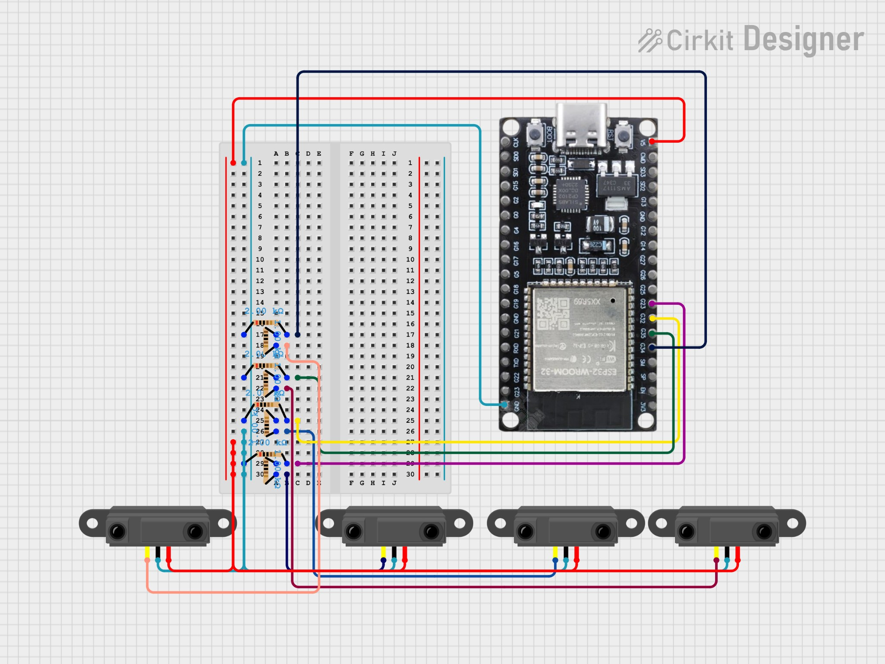

# FRC 2026 Fuel Hub Counter

Automated fuel scoring counter for the **2026 FRC game REBUILT**, by Team 2630.

## Project description

This repository contains firmware and instructions for building and running the counter at your field. The web interface includes:

- **Won Auto** and **Lost Auto** – game simulation modes with timed scoring windows.
- **Unlimited** – continuous counting (e.g. for audition or testing).

The README below covers materials, wiring, software setup, and network configuration.

## Materials

- **ESP32-WROOM** development board (also used as the Wi‑Fi access point).
- **4× optical distance sensors** (Modern Robotics PN 45-2006).
- **4× 1 kΩ resistors** and **4× 2 kΩ resistors** (or as in the circuit diagram).
- Breadboard and jumper wires.

## Circuit diagram

The diagram below shows the assembly and wiring (ESP32, breadboard, four IR distance sensors, and pull-down resistors).

## Software installation

1. Install the **Arduino IDE**.
2. Clone or download this repository.
3. In Arduino IDE: **Tools → Board → Boards Manager**, search for **ESP32**, then install **ESP32 by Espressif Systems**.
4. **Tools → Board** → select **DOIT ESP32 DEVKIT V1**.
5. Connect the ESP32 via USB. Open **Tools → Serial Monitor** (115200 baud).
6. Upload the sketch. When the monitor shows "connecting", press the **BOOT** button on the ESP32.
7. Connect your phone or laptop to the Wi‑Fi network **ballCounter** (default password in code).
8. In a browser, open **http://192.168.4.1** to use the counter and reset button.

## Network configuration

### Default (AP mode)

The ESP32 runs as an Access Point at **192.168.4.1**. SSID and password are set in the sketch at **lines 5–6**.

### Joining an existing Wi‑Fi network

1. Set `ssid` and `password` at lines 5–6 to your network.
2. Comment out the AP setup (**lines 119–120**: `WiFi.softAP(...)` and `WiFi.softAPIP()`).
3. Uncomment the STA block (**lines 123–128**: `WiFi.begin(...)` and the `while (WiFi.status() ...)` loop).
4. For a **static IP**, uncomment the `IPAddress` lines **8–10** and set your addresses, then uncomment **lines 114–116** (`WiFi.config(...)`).

*Line numbers may shift if the sketch is edited; search for the comments in the code to find the right blocks.*

## Arduino IDE troubleshooting

- **DEADLINE EXCEED** when adding the ESP32 board: close Arduino IDE, increase the connection timeout in your network settings (e.g. `connection_timeout: 12000s`), then try again.
- **Additional Boards Manager URL** (File → Preferences): use  
  `http://arduino.esp8266.com/stable/package_esp8266com_index.json,https://espressif.github.io/arduino-esp32/package_esp32_index.json`  
  (note: **github.io**, not "gi-thub.io").
- **No numbers in Serial Monitor** after upload: try pressing the **RST** (reset) button on the ESP32.

